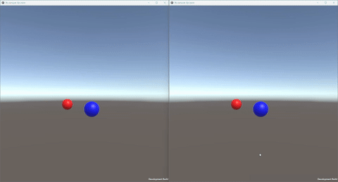


# IFB Realtime Multiplayer Sample

[**RU**](./README.md)

An educational and research-oriented project focused on **real-time network interaction**: a client–server architecture with a Unity client used to visualize synchronized objects.

The project is designed for a **deep understanding of networking architectures**, message queues, latency, interpolation, and state processing in real-time systems (games, simulations).



---

## 🎯 Project Goals

* Understand **how real-time synchronization actually works**
* Move away from the “magic” of ready-made networking engines
* Implement the full pipeline:

    * serialization → sending → receiving → processing → visualization
* Study latency, message queues, ticks, and interpolation in practice

This project **is not a game** and does not aim to be production-ready — the focus is strictly on architecture and learning through implementation.

---

## 🧠 What Is Implemented

* Server and clients written in **.NET**
* Transport layer: **ENet**
* Serialization: **MessagePack**
* Client-side state interpolation
* Incoming message queues
* Unity client as a visual consumer of network state
* Integration tests for network interaction

In Unity:

* each connected client is represented as a sphere
* sphere positions are synchronized in real time
* movement is smoothed on the client side

---

## 🧩 Project Architecture

```
IRM_Network_Sample
├── IRMShared        # Shared structures, messages, enums, buffer pool
├── IRMServer        # Server (relay + client registration logic)
├── IRMClient        # Client library
├── IRMClientCLI     # Console client for testing
├── IRMTests         # Integration tests
└── UnitySample
    └── NetworkPlugin
        └── NetworkTest.unity  # Unity scene with visualization
```

---

## 📦 Core Modules

### `IRMShared`

A shared layer used by both server and clients:

* message types
* delivery flags
* buffers and memory pool
* logging
* message protocol

This layer acts as a **contract**, ensuring that the server and clients speak the same language.

---

### `IRMServer`

The server application:

* accepting client connections
* user registration
* relaying messages between clients
* basic message routing logic

The server **does not handle visualization**, only network state processing.

---

### `IRMClient`

Client-side library:

* connecting to the server
* sending and receiving messages
* incoming packet queue
* preparing data for consumers (CLI / Unity)

---

### `IRMClientCLI`

A simple CLI client used for:

* testing the network protocol
* debugging logic without Unity
* running reproducible scenarios

---

### `IRMTests`

Integration tests:

* client–server interaction validation
* message protocol verification
* basic guarantees of correct data transmission

---

### `UnitySample`

A Unity project that uses the client library:

* visualization of connected clients
* object position synchronization
* client-side movement interpolation
* demonstration of real-time updates

Unity here is **not the architectural core**, but merely a visualization layer.

---

## 🧪 What Can Be Studied Using This Project

The project is intentionally kept simple, making it suitable for exploring:

* the impact of latency and send rate
* message queue processing
* differences between tick-rate and frame-rate
* client-side interpolation
* jitter and uneven packet delivery
* separation of client and server responsibilities
* basics of authority models

---

## 🚀 Who This Project Is For

* Unity developers who want a deeper understanding of networking
* Engineers studying real-time systems
* Those who want to **understand**, not just “use Photon”
* An educational and research project suitable for a portfolio

---

## ⚠️ Important Notes

* The project **is not production-ready**
* No prediction / reconciliation (by design)
* Architecture prioritizes readability over maximum optimization
* Code is written for understanding, not minimal line count